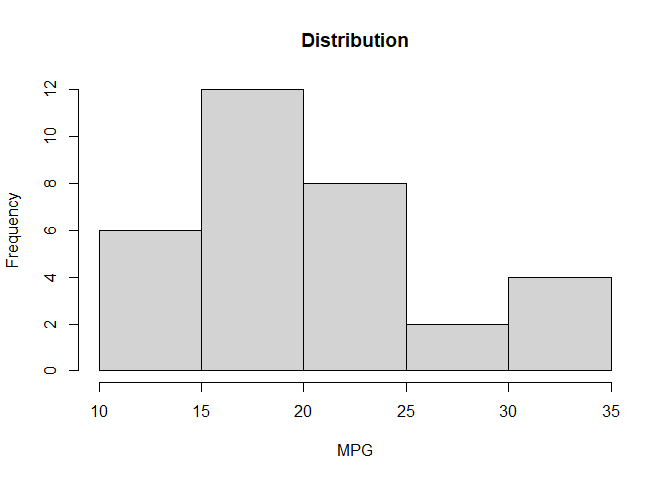
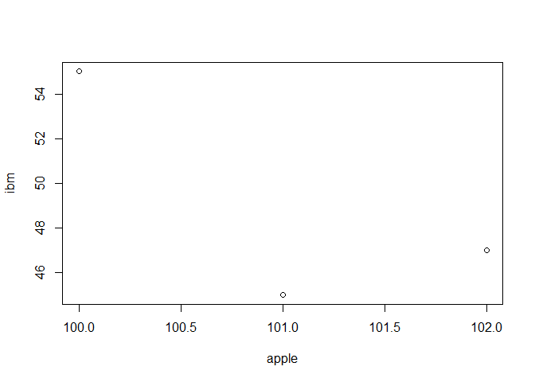

Introduction to R for Finance
================

### Module 02 - Vectors and Matrices

**c()**ombine to create crate vectors

Note: a vector can only be composed of one data type!

``` r
# Numeric
ibm_stock <- c(159.82, 160.02, 159.84)

# Strings
finance <- c("stocks", "bonds", "investments")

# Logical
logic <- c(TRUE, FALSE, TRUE)
```

Use functions **plot()** or **hist()** to visualize datasets.

``` r
data("mtcars") # Built in dataset
v <- mtcars$mpg
hist(v, xlab="MPG", ylab="Frequency", main="Distribution")
```

<!-- -->

Use function **sum()** to sum over the entire vector.

``` r
ret <- c(7, 9) # Return
weight <- c(.2, .8) # Weight
companies <- c("Microsoft", "Sony") # Company Name

# Assign company names to your vectors
names(ret) <- companies
names(weight) <- companies

# Multiply the returns and weights together 
ret_X_weight <- ret * weight

# Print ret_X_weight
ret_X_weight
## Microsoft      Sony 
##       1.4       7.2

# Sum to get the total portfolio return
portf_ret <- sum(ret_X_weight)

cat("Total Portfolio Return:", portf_ret)
## Total Portfolio Return: 8.6
```

You can subset a vector using brakets: \[ \]

``` r
print("First five items:")
## [1] "First five items:"
v[1:5]
## [1] 21.0 21.0 22.8 21.4 18.7

print("All except first:")
## [1] "All except first:"
v[-1]
##  [1] 21.0 22.8 21.4 18.7 18.1 14.3 24.4 22.8 19.2 17.8 16.4 17.3 15.2 10.4 10.4
## [16] 14.7 32.4 30.4 33.9 21.5 15.5 15.2 13.3 19.2 27.3 26.0 30.4 15.8 19.7 15.0
## [31] 21.4

# Last item of a vecotr
print("Last item:")
## [1] "Last item:"
cat(v[length(v)], tail(v, n=1))
## 21.4 21.4
```

Create a Matrix using function **matrix()**

``` r
# Vector
my_vector <- c(1, 2, 3, 4, 5, 6, 7, 8, 9)

# 3x3 matrix
my_matrix <- matrix(data = my_vector, nrow = 3, ncol = 3)

my_matrix
```

    ##      [,1] [,2] [,3]
    ## [1,]    1    4    7
    ## [2,]    2    5    8
    ## [3,]    3    6    9

``` r
# Filling across using byrow = TRUE
matrix(data = c(2, 3, 4, 5), nrow = 2, ncol = 2, byrow = TRUE)
```

    ##      [,1] [,2]
    ## [1,]    2    3
    ## [2,]    4    5

Merge vectors to create a matrix using **cbind()** or **rbind()**

``` r
apple <- c(100, 101, 102)
ibm <- c(55, 45, 47)

cbind_stocks <- cbind(apple, ibm)
cbind_stocks
##      apple ibm
## [1,]   100  55
## [2,]   101  45
## [3,]   102  47

rbind_stocks <- rbind(apple, ibm)
rbind_stocks
##       [,1] [,2] [,3]
## apple  100  101  102
## ibm     55   45   47

plot(cbind_stocks)
```

<!-- -->
Use function **cor()** to calculate correlation between variables

``` r
cor(cbind_stocks)
```

    ##            apple        ibm
    ## apple  1.0000000 -0.7559289
    ## ibm   -0.7559289  1.0000000

To subset a matrix: **my_matrix\[row, col\]**

``` r
cbind_stocks[1,] # First row
## apple   ibm 
##   100    55
cbind_stocks[,"apple"] # apple column
## [1] 100 101 102
cbind_stocks[1,1]
## apple 
##   100
```
