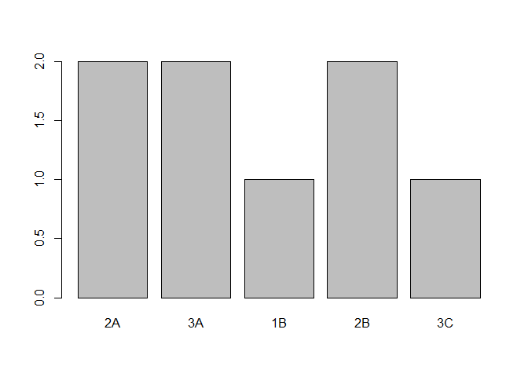
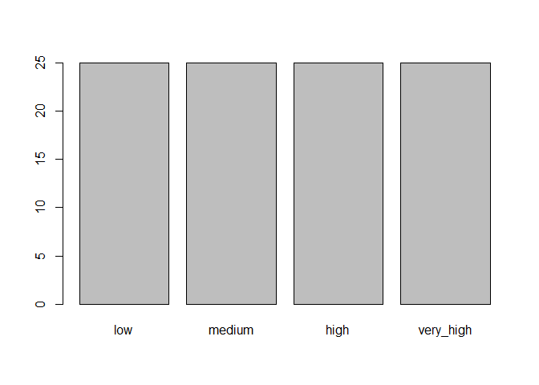
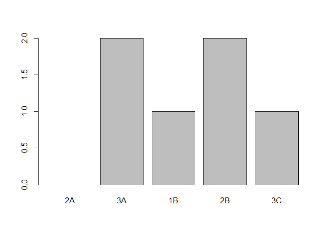
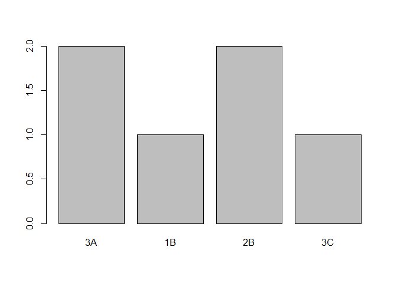

Introduction to R for Finance
================

### Module 04 - Factors

Factors are used to work with categorical variables.

``` r
# Vector to transform
credit_rating <- c("BB", "AAA", "AA", "CCC", "AA", "AAA", "B", "BB")

# Factor constructor
credit_factor <- factor(credit_rating)
credit_factor
```

    ## [1] BB  AAA AA  CCC AA  AAA B   BB 
    ## Levels: AA AAA B BB CCC

``` r
# Call str() on credit_rating
str(credit_rating)
```

    ##  chr [1:8] "BB" "AAA" "AA" "CCC" "AA" "AAA" "B" "BB"

``` r
# Call str() on credit_factor
str(credit_factor)
```

    ##  Factor w/ 5 levels "AA","AAA","B",..: 4 2 1 5 1 2 3 4

To access and/or rename the levels of a factor by **levels()**

``` r
# Print levels
levels(credit_factor)
```

    ## [1] "AA"  "AAA" "B"   "BB"  "CCC"

``` r
# Rename levels
levels(credit_factor) <- c("2A", "3A", "1B", "2B", "3C")
levels(credit_factor)
```

    ## [1] "2A" "3A" "1B" "2B" "3C"

``` r
plot(credit_factor)
```

<!-- -->

``` r
# Ranking
AAA_ranks <- seq(1, 100)

# Factor & groups
AAA_factor <- cut(AAA_ranks, breaks = c(0,25,50,75,100))

# Rename levels
levels(AAA_factor) <- c("low", "medium", "high", "very_high")

plot(AAA_factor)
```

<!-- -->

For ordered factors:

- When creating a factor, specify ordered = TRUE and add unique levels
  in order from least to greatest.

- For an existing unordered factor like credit_factor, use the ordered()
  function and specify levels.

``` r
# Vector
credit_rating
```

    ## [1] "BB"  "AAA" "AA"  "CCC" "AA"  "AAA" "B"   "BB"

``` r
# Ordered
credit_factor_ordered <- factor(credit_rating, ordered = TRUE, levels = c("AAA", "AA", "B", "BB", "CCC"))

credit_factor_ordered
```

    ## [1] BB  AAA AA  CCC AA  AAA B   BB 
    ## Levels: AAA < AA < B < BB < CCC

``` r
plot(credit_factor_ordered)
```

<!-- -->

To subset Factors, use brackets \[\]

``` r
# Subsetting
credit_factor[1:3]
```

    ## [1] 2B 3A 2A
    ## Levels: 2A 3A 1B 2B 3C

``` r
credit_factor[2]
```

    ## [1] 3A
    ## Levels: 2A 3A 1B 2B 3C

``` r
# Remove items, without drop
keep_level <- credit_factor[c(-3,-5)]
plot(keep_level)
```

<!-- -->

``` r
# Remove items, with drop = remove levels
drop_level <- credit_factor[c(-3,-5), drop=TRUE]
plot(drop_level)
```

<!-- -->
