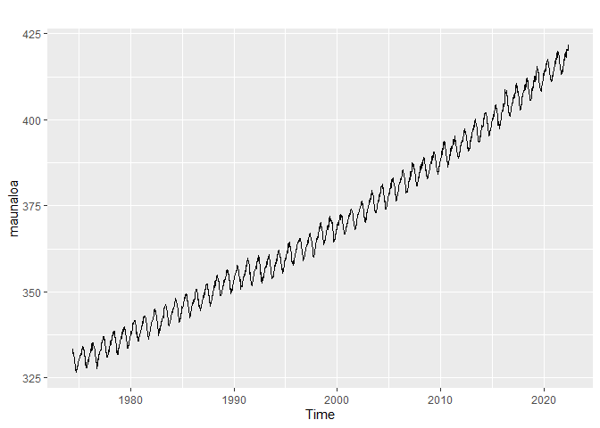

Manipulating Time Series Data in R
================

### Module 01 - What Is Time Series Data?

A **time series** is a collection of data points ordered sequentially
over time.

Time series objects: work better with specialized tools!

``` r
# Open data
maunaloa <- readRDS("maunaloa.Rds")

# Load ggplot2
library(forecast, ggplot2)
```

    ## Registered S3 method overwritten by 'quantmod':
    ##   method            from
    ##   as.zoo.data.frame zoo

``` r
# Plot time serie object
autoplot(maunaloa)
```

<!-- -->

Some of the most essential information about your dataset is its
**summary statistics**, which include attributes like the mean, minimum,
maximum, median, and so on.

``` r
summary(maunaloa)
```

    ##    Min. 1st Qu.  Median    Mean 3rd Qu.    Max. 
    ##   326.7   347.6   366.1   369.2   389.6   421.6

Date-Time classes:

- Date: “2022-08-01”

- POSIXct: “2022-08-09 20:17:00 UTC”

- **lubridate**::as_date() vs base::as.Date() \> better support +
  warnings for invalids + easier conversions

``` r
# Char vector
weekends <- c("2019-01-05", "2019-01-06", "2019-01-12", "2019-01-13", "2019-01-19")
class(weekends)
```

    ## [1] "character"

``` r
library(lubridate)
```

    ## 
    ## Attaching package: 'lubridate'

    ## The following objects are masked from 'package:base':
    ## 
    ##     date, intersect, setdiff, union

``` r
# Convert to date
weekends_date <- as_date(weekends)
class(weekends_date)
```

    ## [1] "Date"

ISO 8601: year-month-day

To convert Date format: **lubridate::parse_date_time()**

``` r
# Char vector
dates <- c("2019-01-01", "2019-01-02", "2019-01-03", "2019-01-04", "2019-01-05")
class(dates)
```

    ## [1] "character"

``` r
# Convert to Date
dates_converted <- as_date(dates)
class(dates_converted)
```

    ## [1] "Date"

``` r
# Mixed char vector: / and -
dates2 <- c("2019-01-01", "2019-01-02", "01/03/2019", "2019-01-04", "2019-01-05")

# Convert different formats all at once!
parse_date_time(dates2, orders = c("%Y-%m-%d", "%m/%d/%Y"))
```

    ## [1] "2019-01-01 UTC" "2019-01-02 UTC" "2019-01-03 UTC" "2019-01-04 UTC"
    ## [5] "2019-01-05 UTC"
