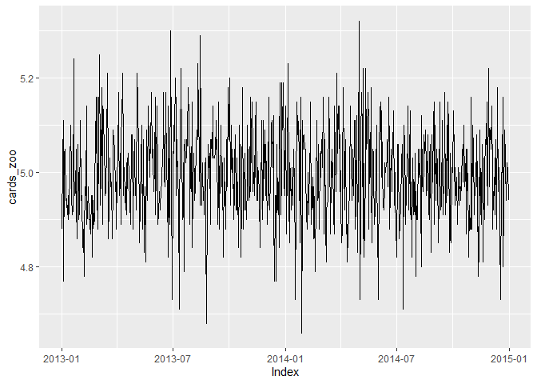
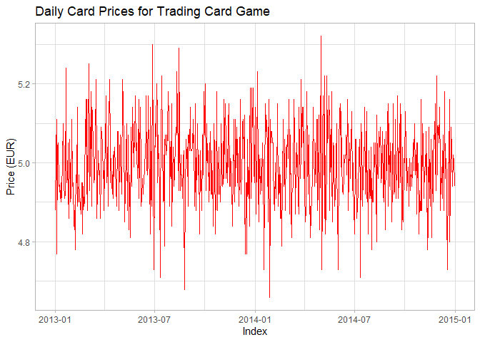
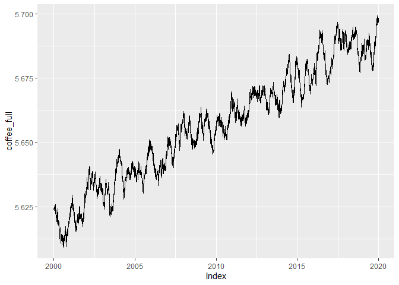

Manipulating Time Series Data in R
================

### Module 02 - Manipulating Time Series with zoo

Temporal attributes:

- Start point: **start(ts)**
- End point: **end(ts)**
- Frequency: **frequency(ts)**

Regular vs. irregular time series:

- **Regular**: Evenly-spaced intervals + No missing values
- **Irregular**: Spacing can be irregular (Weekdays, random days)

``` r
library(lubridate)
## 
## Attaching package: 'lubridate'
## The following objects are masked from 'package:base':
## 
##     date, intersect, setdiff, union

# Load data
maunaloa <- readRDS("maunaloa.Rds")
class(maunaloa)
## [1] "ts"

# ts attributes
start(maunaloa)
## [1] 1974.374
print(paste("Start:", date_decimal(start(maunaloa))))
## [1] "Start: 1974-05-17 16:30:38.786991"

end(maunaloa)
## [1] 2022.402
print(paste("End:", date_decimal(end(maunaloa))))
## [1] "End: 2022-05-27 16:30:38.786993"

frequency(maunaloa) # Weekly
## [1] 52.17855
```

The start and end points of a time series are stored like any other date
or time object in R, meaning you can perform tests to compare them, as
well as perform arithmetic to determine the time interval between them.

``` r
date_start <- start(maunaloa)
date_end <- end(maunaloa)
date_end - date_start # Date difference
```

    ## [1] 48.0274

The **zoo package**:

- Provides **zoo class** of objects
- Functions for manipulating and visualizing time series data

zoo vs base R:

- Base R: Only regularly-spaced intervals + Can be tedious to create
  data frames
- zoo: Regular or irregular intervals + Methods for converting to data
  frame

``` r
library(zoo)
```

    ## 
    ## Attaching package: 'zoo'

    ## The following objects are masked from 'package:base':
    ## 
    ##     as.Date, as.Date.numeric

``` r
library(ggplot2)

# Load data
cards_index <- readRDS("cards_index.rds")
head(cards_index)
```

    ## [1] "2013-01-01" "2013-01-02" "2013-01-03" "2013-01-04" "2013-01-05"
    ## [6] "2013-01-06"

``` r
cards_price <- readRDS("cards_price.rds")
head(cards_price)
```

    ## [1] 4.88 5.03 5.11 4.77 5.04 5.05

``` r
# Create a zoo object: cards_zoo
cards_zoo <- zoo(x = cards_price, order.by = cards_index)

# Autoplot cards_zoo
autoplot(cards_zoo)
```

<!-- -->

Zoo attributes:

- **index(zoo)**
- **coredata(zoo)**

``` r
# Enter the x and y axis mapping aesthetics
ggplot(cards_zoo, aes(x = Index, y = cards_zoo)) + 
  scale_y_continuous() + 
  # Plot the data with a red-colored line
  geom_line(color="red") + 

  # Use the light theme
  theme_light() + 

  # Enter the appropriate axis labels and title
  labs(
    x="Index", y="Price (EUR)", title="Daily Card Prices for Trading Card Game"
  )
```

<!-- -->

``` r
library(magrittr)

# Load data
coffee_2000s <- readRDS("coffee2000.rds")
coffee_2010s <- readRDS("coffee2010.rds")

# Assign the index to index_2000s
index_2000s <- index(coffee_2000s)

# Parse the day-month-Year index_2000s
index_parsed <- parse_date_time(
  index_2000s,
  orders = "%Y-%m-%d") %>% as_date()

# Create a zoo based on the new index
coffee_parsed <- zoo(x = coredata(coffee_2000s),
                     order.by = index_parsed)

# Combine the time series and plot the result
coffee_full <- c(coffee_parsed, coffee_2010s)
autoplot(coffee_full)
```

<!-- -->

Time series are said to **overlap** when there are observations in both
time series with the same index, meaning they occur at the same point in
time.

By creating a subset using the **%in% operator**, the overlapping points
can be filtered out of one of the time series, allowing the two datasets
to be *combined*.

``` r
# Determine the overlapping indexes
overlapping_index <-
  index(coffee_overlap) %in% index(coffee)

# Create a subset of the elements which do not overlap
coffee_subset <- coffee_overlap[!overlapping_index]

# Combine the coffee time series and the new subset
coffee_combined <- c(coffee, coffee_subset)

autoplot(coffee_combined)
```

data.frame versus zoo:

- **data.frame**: Each variable stored as a column + Index stored as
  column (e.g.: data\$dates)
- **zoo**: Each variable stored as matrix column + Index stored as
  attribute (e.g.: index(data))

Use **fortify.zoo()** to convert zoo in data.frame:

``` r
# Fortify to data frame: cards_df
cards_df <- fortify.zoo(card_prices)

# Add together the three price columns from cards_df
cards_df$total_price <- cards_df$price_1 + cards_df$price_2 + cards_df$price_3

# Create the total_price_zoo time series
total_price_zoo <- zoo(x=cards_df$total_price, order.by=cards_df$Index)

# Generate an autoplot of the new time series
autoplot(total_price_zoo)
```
