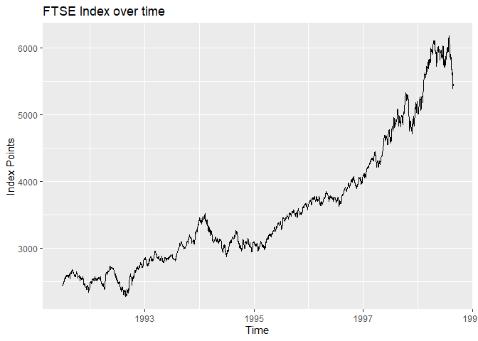
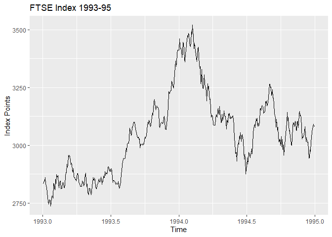
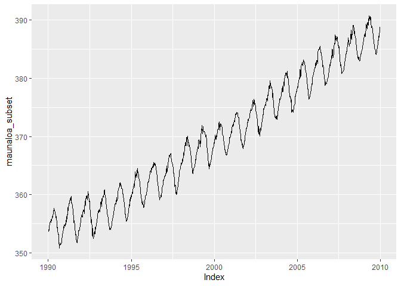
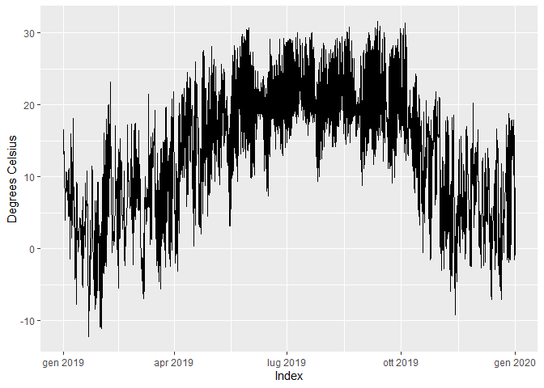
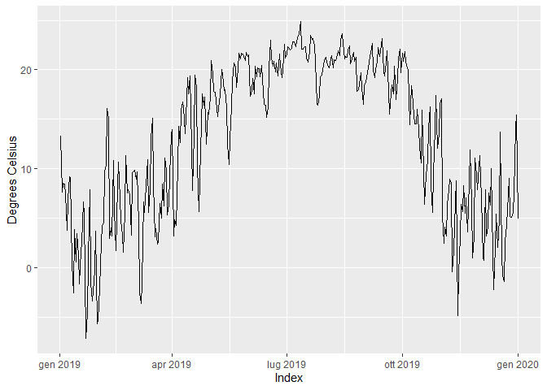
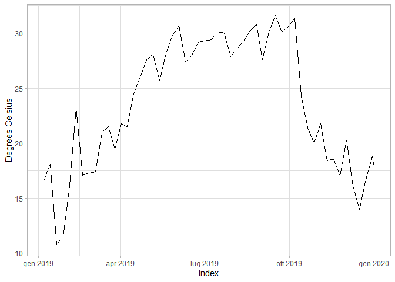
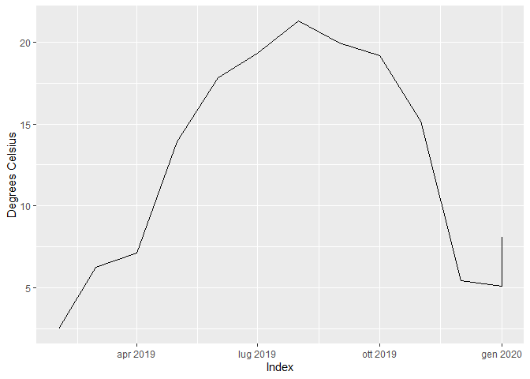
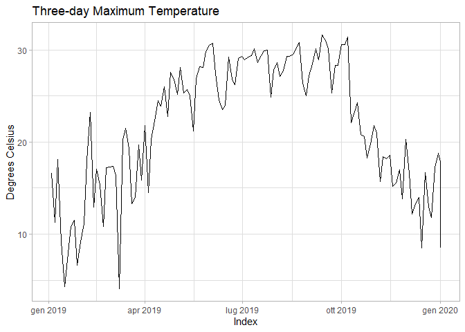
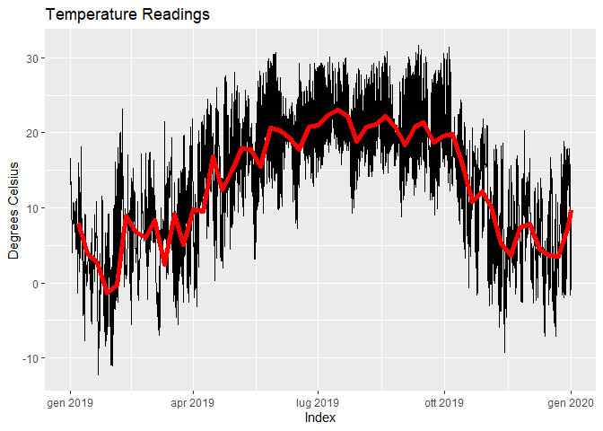

Manipulating Time Series Data in R
================

### Module 03 - Indexing Time Series Objects

Time Series **Windows \> window()**:

- Subset of time series
- Inherits frequency from parent time series
- Defined by start and end point

``` r
library(zoo)
```

    ## 
    ## Attaching package: 'zoo'

    ## The following objects are masked from 'package:base':
    ## 
    ##     as.Date, as.Date.numeric

``` r
library(ggplot2)
library(lubridate)
```

    ## 
    ## Attaching package: 'lubridate'

    ## The following objects are masked from 'package:base':
    ## 
    ##     date, intersect, setdiff, union

``` r
# Load data
ftse <- as.zoo(readRDS("ftse.Rds"))

# Plot all
autoplot(ftse) + labs(x="Time", y="Index Points", title="FTSE Index over time")
```

<!-- -->

``` r
# Window
ftse_subset <- window(ftse, start="1993-01-01", end="1995-01-01")

# Plot Windows 1993-95
autoplot(ftse_subset) + labs(x="Time", y="Index Points", title="FTSE Index 1993-95")
```

<!-- -->

Extract observations with brackets \[\]:

``` r
# Fix index: from decimal to date
index(ftse) <- as.Date(date_decimal(index(ftse)))

ftse["1994-12-06"]
```

    ## 1994-12-06 
    ##     3039.6

Subsetting & plotting:

``` r
# Load data
maunaloa <- as.zoo(readRDS("maunaloa.Rds"))

# Filter
subset <- index(maunaloa) >= 1990 & index(maunaloa) <= 2010

# Extract the subset of maunaloa
maunaloa_subset <- maunaloa[subset]

# Autoplot the subsetted maunaloa dataset
autoplot(maunaloa_subset)
```

<!-- -->

From zoo, **yearmon()** and **yearqtr()**

``` r
char <- "2024-05-25"

as.yearmon(char)
## [1] "mag 2024"
as.yearqtr(char, format="%Y-%m-%d")
## [1] "2024 Q2"
```

``` r
# Create a year-monthly index
index_yearmon <- as.yearmon(date_index_month)

# Create a zoo object from the year-month index and monthly data
monthly_sales <- zoo(monthly_data, order.by=index_yearmon)

# Autoplot with titles and axis labels
autoplot(monthly_sales) + labs(x="Month",y="Sales ($100k)", title="Corporate Sales Data")
```

``` r
# Create a year-quarter index
index_yearqtr <- as.yearqtr(date_index_quarter)

# Create the quarterly_sales zoo object
quarterly_sales <- zoo(quarterly_data, order.by=index_yearqtr)

# Autoplot with axis labels and a title
autoplot(quarterly_sales) + labs(x="Quarter", y="Quarterly Sum ($100k)", title="Quarterly Sales Report")
```

#### xts package:

- eXtensible Time Series
- Extends the zoo package and zoo class of objects

``` r
# Load data
hourly_temperature <- readRDS("htemp.rds")

autoplot(hourly_temperature) + ylab("Degrees Celsius")
```

<!-- -->
**apply.daily()** \> aggregate over day with specific function

``` r
library(xts)

# Aggregate to the daily average and autoplot with label
daily_average <- apply.daily(hourly_temperature, FUN=mean)
```

    ## NOTE: `apply.daily(..., FUN = mean)` operates by column, unlike other math
    ##   functions (e.g. median, sum, var, sd). Please use `FUN = colMeans` instead,
    ##   and use `FUN = function(x) mean(x)` to take the mean of all columns. Set
    ##   `options(xts.message.period.apply.mean = FALSE)` to suppress this message.

``` r
autoplot(daily_average) + 
  labs(y = "Degrees Celsius")
```

<!-- -->

``` r
# Aggregate the weekly maximum and plot with label and theme
weekly_max <- apply.weekly(hourly_temperature, FUN=max)

autoplot(weekly_max) + 
  labs(y = "Degrees Celsius") + theme_light()
```

<!-- -->

``` r
# Aggregate to the monthly median and autoplot
monthly_median <- apply.monthly(hourly_temperature, FUN=median)

autoplot(monthly_median) +
  labs(y = "Degrees Celsius")
```

<!-- -->

The apply.-() functions from **xts** make for convenient aggregation,
and are often the best choice functions to use, but sometimes you might
want more control over the level of aggregation in your data.

For **custom aggregation**: endpoints() + period.apply()

``` r
# Create the index from every third day.
three_day_index <- endpoints(x = hourly_temperature,
                             on = "days",
                             k = 3)

# Apply the maximum to the time series using the index
three_day_max <- period.apply(x = hourly_temperature,
                              INDEX = three_day_index,
                              FUN = max)

# Autoplot with labels and theme
autoplot(three_day_max) + 
  labs(
    title="Three-day Maximum Temperature",
    y="Degrees Celsius"
  ) + theme_light()
```

<!-- -->

``` r
# Weekly avg
weekly_avg <- apply.weekly(hourly_temperature, FUN=mean)
```

    ## NOTE: `apply.weekly(..., FUN = mean)` operates by column, unlike other math
    ##   functions (e.g. median, sum, var, sd). Please use `FUN = colMeans` instead,
    ##   and use `FUN = function(x) mean(x)` to take the mean of all columns. Set
    ##   `options(xts.message.period.apply.mean = FALSE)` to suppress this message.

``` r
# Create a plot of the hourly_temperature time series
ggplot(hourly_temperature,
       aes(x = Index, y = hourly_temperature)) + 
  scale_y_continuous() + 
  geom_line() + 

  # Add axis label and title
  labs(y = "Degrees Celsius",
       title = "Temperature Readings") + 

  # Add a line plot for the weekly aggregated time series
  geom_line(data = weekly_avg,
            aes(x = Index, y = weekly_avg),
  # Color the aggregated line in red, with a size of 2
            color = "red", linewidth = 2) 
```

<!-- -->

#### Imputing missing values

na-dot functions from zoo:

- na.fill(): fill with value
- na.locf(): carry forwards
- na.approx(): linear interpolation

``` r
# Add together the number of NA values
sum(is.na(car_sales))

# Fill in missing values with zero
car_sales_filled <- na.fill(car_sales, fill=0)
```

Last observation carried forward (LOCF):

``` r
# Impute using last observation carried forward
monthly_scores_locf <- na.locf(monthly_test_scores)
```

Linear interpolation

``` r
# Fill in values with linear approximation
maunaloa_linear <- na.approx(maunaloa_missing)
```
